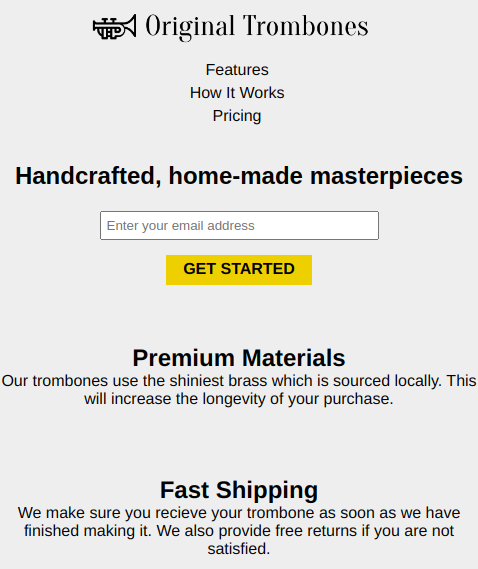

# Product landing Page
  Original Trombones Product Landing page

## Getting Started
  - fork and clone this repo.
  - download it
  - run it on your local server
  - visit it on your web browser

## Deployment
  Take a look at the live version [**Click here**](https://olumide025.github.io/Landing-Page/)  
  scroll and resize to see its responsivenes
## Screenshot
mobile view

  

## Built With
  - HTML
  - CSS
  - Font Awesome
  - Some Images  

## Prerequisites
  - local server
  - web browser e.g. chrome

## Usage and properties
  - view on any device
  - responsive

# Author
  Abeeb Ridwan Olumide

## License
  This project is licensed under the MIT License - see the [license](license) file for details

